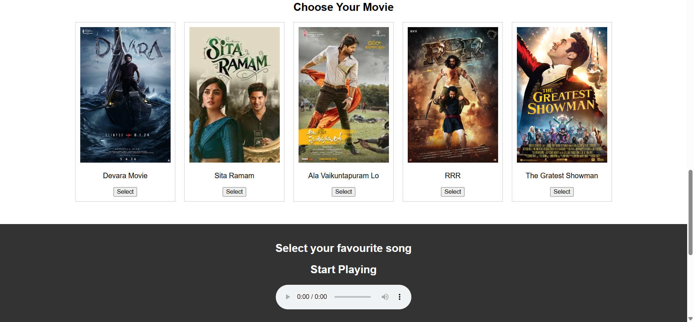
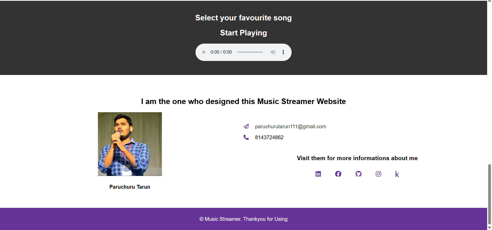

# 🎵 Music Streamer

A sleek and responsive static music streaming website built with HTML, CSS, and JavaScript. Play and browse music from a beautiful UI with lightweight performance and zero backend requirements.





## 🔥 Check It Out

Check out the live version here: [Website URL](https://paruchurutarun.github.io/Music-Streamer/)

## 🧰 Features

- 🎧 Stream locally hosted music files
- 🔀 Play/Pause, Skip, Repeat, and Shuffle controls
- 🕶️ Clean, responsive UI (desktop & mobile)
- 📂 Organize music via folders or playlists
- 🌙 Light/Dark theme toggle
- 🎨 Fully customizable and lightweight


## 🛠️ Built With

- HTML5
- CSS3 (Flexbox & Grid)
- Vanilla JavaScript
- [FontAwesome](https://fontawesome.com/) for icons

## 📦 Installation

1. Clone the repo:
   ```bash
   git clone https://github.com/paruchurutarun/Music-Streamer.git
   
